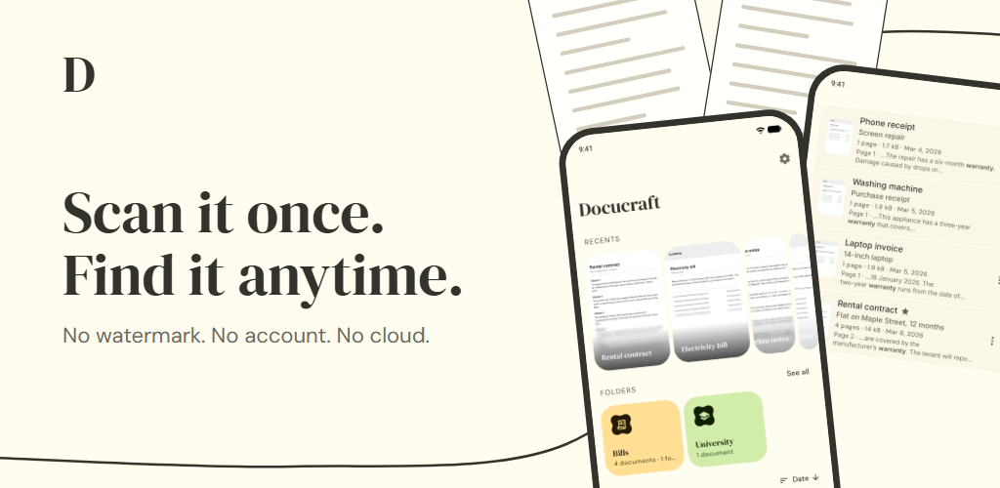
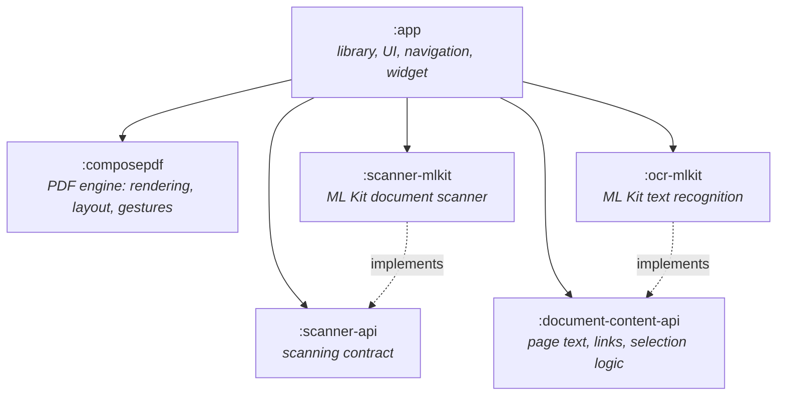

<div align="center">


# Docucraft

**Scan, organize and read your documents. All of it on your device.**

A document scanner, a searchable library and a PDF reader in one Android app.<br/>
No account, no cloud, no watermarks.

<p>
  <a href="https://play.google.com/store/apps/details?id=com.bobbyesp.docucraft"></a>
</p>

<p>
  <a href="https://kotlinlang.org/"></a>
  <a href="https://developer.android.com/jetpack/compose"></a>
  <a href="https://developers.google.com/ml-kit"></a>
  
  <a href="./LICENSE"></a>
  <a href="https://github.com/BobbyESP/Docucraft/stargazers"></a>
</p>

[Features](#features) · [Privacy](#privacy) · [Under the hood](#under-the-hood) · [Build it](#build-it) · [Contributing](#contributing)

<br/>



</div>

<br/>

## Features

<table>
<tr>
<td width="50%" valign="top">

### 📷 Scan

- **Automatic edge detection, cropping and cleanup**, with a model that runs on the phone.
- **Many pages, one PDF**, from the camera or from photos you already have. Crop, rotate, filter or
  retake any page before saving.
- **Review as you save**: name the scan, describe it, file it in a folder and tag it. Or skip, and
  it is saved as it came.
- **A home-screen widget** that goes straight to the scanner.

</td>
<td width="50%" valign="top">

### 🗂️ Organize

- **Folders inside folders**, each with its own color and icon. Pin the ones you use to Home.
- **Tags**, as many per document as you like, and a Home section for the ones you choose.
- **Favorites**, and **Recents** for what you opened last.
- **A bin**: a deleted document can be restored for 30 days.

</td>
</tr>
<tr>
<td width="50%" valign="top">

### 🔎 Find

- **Search inside your documents**, not only their names: results are ranked by relevance and show
  the page and the words around the match.
- **Case and accents do not matter**: `cancion` finds *Canción*.
- **Text recognition (OCR) on the device**, for scans and image-only PDFs. It is your choice, per
  document.
- **Filter** by favorites and tags, **sort** each folder its own way.

</td>
<td width="50%" valign="top">

### 📖 Read

- **A PDF viewer built for the app**, with smooth zoom, four fit modes, night mode and a fast
  scroller.
- **Opens any PDF** from your file manager, mail or chat, and can keep a copy in your library.
- **Select and copy text**, across pages, even on a scanned page once its text is recognized.
- **Picks up where you left off**, on the same line.
- **Safe links**: you see where a link really leads before anything opens.

</td>
</tr>
<tr>
<td width="50%" valign="top">

### 📤 Share

- **Share, print, export or open with another app.**
- The file another app receives carries the name you gave the document.
- **No watermarks**, ever.

</td>
<td width="50%" valign="top">

### 🎨 Make it yours

- **Material 3 Expressive**, with dynamic color from your wallpaper or a color you pick.
- Light, dark and high-contrast themes, palette styles and fonts.
- **Adapts to tablets and foldables**: the document opens beside the list.
- **13 languages**, and TalkBack support in the viewer.

</td>
</tr>
</table>

<details>
<summary><b>Languages</b></summary>
<br/>

English, Arabic, Chinese, Dutch, French, German, Hindi, Italian, Japanese, Korean, Portuguese,
Russian and Spanish.

</details>

## Privacy

Docucraft is local-first: **your documents never leave your device unless you share them.**

- **Scanning and text recognition run on the device**, through Google's ML Kit. Nothing is uploaded
  to be processed.
- **No account and no cloud.** Documents are kept in the app's private storage, and the library and
  its search index in a local database.
- **Other apps' PDFs are opened, not copied.** Docucraft keeps a reference to them and nothing else,
  until you choose *Save to Docucraft*.
- **Links are checked before they open.** Only web, email and phone links are followed, and a web
  link is shown by the address a browser would really open, so a look-alike does not pass for the
  real one.
- **What is collected**: usage events and crash reports, through Firebase Analytics and
  Crashlytics. Never your documents, nor their text.

## Under the hood

### Tech stack

| Area | Technology |
|:--|:--|
| **Language** | [Kotlin](https://kotlinlang.org/), with coroutines and Flow |
| **UI** | [Jetpack Compose](https://developer.android.com/jetpack/compose), Material 3 Expressive, Material 3 Adaptive, [Glance](https://developer.android.com/develop/ui/compose/glance) for the widget |
| **Navigation** | [Navigation 3](https://developer.android.com/guide/navigation/navigation-3): one back stack, typed keys, sheets and dialogs as destinations |
| **Architecture** | Clean architecture by feature, MVI ViewModels, ports and sealed results |
| **Dependency injection** | [Koin](https://insert-koin.io/) |
| **Storage** | [Room](https://developer.android.com/training/data-storage/room) with FTS4 full-text search, [DataStore](https://developer.android.com/topic/libraries/architecture/datastore) |
| **Background work** | [WorkManager](https://developer.android.com/topic/libraries/architecture/workmanager) |
| **On-device ML** | ML Kit [Document Scanner](https://developers.google.com/ml-kit/vision/doc-scanner) and [Text Recognition](https://developers.google.com/ml-kit/vision/text-recognition/v2) |
| **PDF** | An in-house Compose engine over the platform's `PdfRenderer` |
| **Theming** | [MaterialKolor](https://github.com/jordond/MaterialKolor), [Haze](https://github.com/chrisbanes/haze) |
| **Files** | [FileKit](https://github.com/vinceglb/FileKit) |

### Modules

Every SDK sits behind a contract in plain Kotlin, so the scanner and the text recognizer can each be
replaced by changing one line of dependency injection, and no ML Kit type ever reaches the app.



### Documentation

How each part works, and why it was built that way, is written down in [`docs/`](docs/README.md):

| Document | Covers |
|:--|:--|
| [Architecture](docs/architecture.md) | Modules, layers, ports, ViewModels, theme and blur |
| [Navigation](docs/navigation.md) | One back stack, scenes, modal destinations |
| [Scanning](docs/scanning.md) | The scanning contract, saving, search, reading the text of pages |
| [Database](docs/database.md) | The catalogue's tables and rules, migrations, the bin |
| [Organization](docs/organization.md) | Folders, tags and favorites |
| [PDF engine](docs/pdf-engine.md) | Rendering, layout, gestures, extension points |
| [PDF viewer](docs/pdf-viewer.md) | The viewer's screen, settings and the viewer for other apps' PDFs |
| [Text and links](docs/text-and-links.md) | Page content, text selection, safe links |
| [Testing](docs/testing.md) | What is tested where, fixtures, checking by hand |

## Build it

**You need** a recent Android Studio, JDK 17, and a device or emulator on Android 7.0 (API 24) or
later with Google Play services, which provide the scanner and the recognition model.

```bash
git clone https://github.com/BobbyESP/Docucraft.git
cd Docucraft
```

Firebase is part of the build and its configuration is not in the repository. Create a
[Firebase project](https://console.firebase.google.com/), register the Android apps
`com.bobbyesp.docucraft` and `com.bobbyesp.docucraft.debug`, and place its `google-services.json` in
`app/`.

Then open the project in Android Studio and run it, or from a terminal (on Windows,
`.\gradlew.bat`):

| Task | Command |
|:--|:--|
| Debug APK | `./gradlew :app:assembleDebug` |
| Unit tests | `./gradlew testDebugUnitTest :scanner-api:test :document-content-api:test` |
| Instrumented tests | `./gradlew :app:connectedDebugAndroidTest :composepdf:connectedDebugAndroidTest` |
| Format | `./gradlew spotlessApply` |

> [!NOTE]
> Instrumented tests run on every attached device. Set `ANDROID_SERIAL` to target one.

## Good to know

- **Google Play services are required** for scanning and for text recognition.
- **Selecting a PDF's own text needs Android 15** or later. On earlier versions, text recognition
  covers it for documents in your library.
- **Search finds whole words and their beginnings**, and does not yet split Chinese, Japanese or
  Korean text into words.
- **PDFs are opened from the device.** One behind a web address is not downloaded yet.

## Contributing

Issues and pull requests are welcome. Before changing a subsystem, read its document in
[`docs/`](docs/README.md) and the rules in [`AGENTS.md`](AGENTS.md).

- Commits follow `type(scope): summary`, and the body says why.
- Run `./gradlew spotlessApply` before committing.
- A new string needs its translation in every language of `app/src/main/res/values-*`.

## License

Docucraft is free software, distributed under the **GNU General Public License v3.0**. See
[LICENSE](LICENSE).

---

<div align="center">

Built with ❤️ by [Bobby](https://github.com/BobbyESP)

*If Docucraft is useful to you, a star helps others find it.* ⭐

</div>
